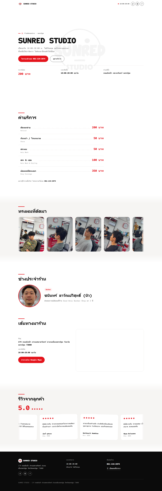

# SUNRED STUDIO

เว็บไซต์หน้าเดียว (single-page site) สำหรับร้านตัดผมชาย **SUNRED STUDIO** จังหวัดนครปฐม — แสดงค่าบริการ ผลงานทรงผม ช่างประจำร้าน แผนที่/เส้นทางมาร้าน และรีวิวจากลูกค้า พร้อมปุ่มโทรจองคิวและลิงก์โซเชียลของร้าน



## ข้อมูลร้าน

| | |
|---|---|
| ชื่อร้าน | SUNRED STUDIO |
| ที่อยู่ | 174 ถนนยิงเป้า ตำบลสนามจันทร์ อำเภอเมืองนครปฐม จังหวัดนครปฐม 73000 |
| เวลาเปิด-ปิด | 10:00–20:00 น. ทุกวัน ไม่มีวันหยุด |
| โทร | [061-134-2874](tel:+66611342874) |
| ราคาเริ่มต้น | 200 บาท (ตัดผมชาย) |
| Facebook | https://www.facebook.com/share/1a7z971wAq/ |
| Instagram | https://www.instagram.com/sunred.studio/ |
| TikTok | https://www.tiktok.com/@sunred.studio |

## ฟีเจอร์หลัก

- **หน้าเดียวจบ (single `index.html`)** — ไม่มีขั้นตอน build ไม่ต้องติดตั้งอะไร เปิดไฟล์ก็ใช้งานได้ทันที
- **Hero section** พร้อมชื่อร้าน เวลาเปิดปิด ที่ตั้ง และราคาเริ่มต้น พร้อมปุ่ม "โทรจองคิวเลย" และ "ดูค่าบริการ"
- **รายการค่าบริการ** (`#services`) แบบ dotted price list อ่านง่าย
- **แถบรูปทรงผมที่ตัดมา** (`#cuts`) เลื่อนอัตโนมัติแบบ marquee ไม่มีที่สิ้นสุด (วนลูป) พร้อม lightbox กดดูรูปเต็มจอ
- **ช่างประจำร้าน** (`#barber`) รูปวงกลมขอบแดง + ชื่อ + ตำแหน่ง + ประวัติย่อ — รองรับเพิ่มช่างหลายคน
- **เส้นทางมาร้าน** (`#location`) ฝัง Google Maps จริงในหน้าเว็บ พร้อมปุ่มนำทาง (เปิด Google Maps นำทางจากตำแหน่งผู้ใช้)
- **รีวิวจากลูกค้า** (`#reviews`) แถบเลื่อนอัตโนมัติเช่นกัน พร้อมคะแนนเฉลี่ยและดาว
- **Footer** สรุปที่อยู่ เวลาทำการ เบอร์โทร ลิงก์แผนที่ และโซเชียลของร้าน
- ปรับให้ใช้งานบนมือถือลื่นไหล (marquee ไม่ค้างบน iOS, เว้นระยะกระชับ, กราฟิกพื้นหลังจางที่ขอบ)
- รองรับ `prefers-reduced-motion` และ dark/print ไม่มีปัญหา — ทุกอนิเมชันปิดได้อัตโนมัติถ้าเบราว์เซอร์ตั้งค่าลดการเคลื่อนไหว
- มี JSON-LD (`schema.org/HairSalon`) ฝังไว้ในหัวไฟล์ ช่วยให้ Google เข้าใจว่านี่คือร้านตัดผม พร้อมที่อยู่/เวลาเปิด/เบอร์โทร สำหรับ SEO และ Google Maps/Search

## เทคโนโลยีที่ใช้

ไม่มี framework หรือ build tool ทั้งหมดอยู่ในไฟล์เดียว:

- **HTML5** โครงสร้างหน้าเว็บ
- **CSS ล้วน** (ฝังอยู่ใน `<style>` ของ `index.html`) ใช้ CSS custom properties (`--red`, `--ink`, `--gap-section` ฯลฯ) เป็นระบบ design token, ใช้ `clamp()` และ media query ทำ responsive
- **Vanilla JavaScript** (ฝังอยู่ใน `<script>` ท้ายไฟล์) จัดการ:
  - เอฟเฟกต์ header โปร่งใส/ทึบตอนเลื่อนหน้าจอ
  - อนิเมชัน hero ตอนโหลดหน้าเสร็จ
  - แถบรูป/รีวิวเลื่อนอัตโนมัติ (marquee) — คัดลอกชุดการ์ดต่อท้ายเองเพื่อวนลูปไม่มีรอยต่อ พร้อมหยุดชั่วคราวเมื่อผู้ใช้แตะ/hover
  - `IntersectionObserver` ทำ scroll-reveal (เนื้อหาค่อยๆ ปรากฏตอนเลื่อนผ่าน)
  - Lightbox สำหรับดูรูปทรงผมแบบเต็มจอ
- **Google Fonts** โหลดผ่าน `<link>` ในหัวไฟล์ (ฟอนต์หัวข้อ/เนื้อหา/ตัวเลขแยกกันผ่านตัวแปร `--font-display` / `--font-body` / `--font-mono`)
- **Google Maps Embed** (iframe แบบไม่ต้องใช้ API key) สำหรับแผนที่ในหน้าเว็บ

## โครงสร้างไฟล์

```
SUNRED STUDIO/
├── index.html          ไฟล์เว็บทั้งหมด (HTML + CSS + JS ในไฟล์เดียว)
├── assets/
│   ├── logo.jpg         โลโก้ร้าน (ต้นฉบับ ใช้ทำ favicon ด้วย)
│   ├── favicon.png       โลโก้ครอปสี่เหลี่ยมจัตุรัส ใช้เป็นไอคอนแท็บเบราว์เซอร์
│   ├── barber.jpg        รูปช่างประจำร้าน
│   └── cuts/
│       ├── cut-1.jpg … cut-9.jpg   รูปผลงานทรงผมที่ใช้ในแถบเลื่อนอัตโนมัติ
└── docs/
    └── screenshot.png    ภาพตัวอย่างหน้าเว็บ (ใช้ใน README นี้)
```

## วิธีรันดูบนเครื่องตัวเอง

เนื่องจากเป็น static site ล้วนๆ เปิดไฟล์ `index.html` ด้วยเบราว์เซอร์ได้เลย แต่แนะนำให้รันผ่านเซิร์ฟเวอร์เล็กๆ เพื่อให้ path รูปภาพและฟอนต์โหลดถูกต้องเหมือนของจริง:

```bash
# ตัวเลือกใดก็ได้ที่มีในเครื่อง
npx serve .
# หรือ
python -m http.server 8000
```

แล้วเปิด `http://localhost:3000` (หรือพอร์ตที่ขึ้น) ในเบราว์เซอร์

## วิธี deploy ขึ้นเว็บจริง

เป็น static site ล้วนๆ จึงใช้บริการ static hosting ฟรีได้เกือบทุกเจ้า เช่น

- **GitHub Pages** — เปิด Settings → Pages ของ repo แล้วเลือก branch `main` root ก็ใช้งานได้ทันที
- **Netlify / Vercel / Cloudflare Pages** — ลาก-วางโฟลเดอร์นี้ หรือเชื่อมกับ GitHub repo แล้ว deploy อัตโนมัติทุกครั้งที่ push (ไม่ต้องตั้งค่า build command เพราะไม่มีขั้นตอน build)

## วิธีแก้ไขเนื้อหาที่พบบ่อย

ทุกจุดแก้ไขอยู่ใน `index.html` ไฟล์เดียว ค้นหา (Ctrl+F) ข้อความเดิมแล้วแก้ได้เลย:

| ต้องการแก้ไข | ค้นหาคำว่า |
|---|---|
| ราคา/รายการบริการ | `price-row` (แต่ละแถวมีชื่อบริการไทย/อังกฤษ + ราคา) |
| เวลาเปิด-ปิด, ที่อยู่ | `เวลาเปิดปิด`, `ทำเลที่ตั้ง`, หรือ `174 ถนนยิงเป้า` |
| เบอร์โทร | `061-134-2874` หรือ `+66611342874` (มีหลายจุด ต้องแก้ให้ครบ) |
| เพิ่ม/ลบรูปทรงผม | อยู่ในเซคชัน `id="cuts"` — คัดลอกทั้งบล็อก `<div class="cut-card">` วางต่อท้ายในชุด `.cuts-set` เดียวกัน (ไม่ต้องคัดลอกซ้ำเป็นชุดที่สอง สคริปต์จะทำเองให้วนลูป) แล้วใส่รูปในโฟลเดอร์ `assets/cuts/` |
| เพิ่ม/ลบรีวิว | อยู่ในเซคชัน `id="reviews"` — คัดลอกทั้งบล็อก `<div class="review-card">` วางต่อท้ายในชุด `.reviews-set` เดียวกัน |
| เพิ่มช่างคนที่สอง | อยู่ในเซคชัน `id="barber"` — คัดลอกทั้งบล็อก `.barber-grid` วางต่อท้ายในกริดเดียวกัน |
| ตำแหน่งบนแผนที่ | ค้นหา `13.808619,100.046272` (มี 4 จุด: JSON-LD, ปุ่มนำทาง, iframe แผนที่, ลิงก์ footer) |
| สี/ธีมของเว็บ | ตัวแปรใน `:root{ }` ช่วงต้นไฟล์ เช่น `--red`, `--ink`, `--paper` |
| ฟอนต์ | ตัวแปร `--font-display` (หัวข้อ), `--font-body` (เนื้อหา/ปุ่ม), `--font-mono` (ตัวเลข/ราคา/เวลา) — อย่าลืมแก้ลิงก์ Google Fonts บรรทัด `<link href="https://fonts.googleapis.com/css2?family=...">` ให้ตรงกับฟอนต์ใหม่ด้วย |

> มีคอมเมนต์ภาษาไทยกำกับไว้ในโค้ดตรงจุดที่ต้องแก้บ่อย (เช่น แถบรูปทรงผม, แถบรีวิว, ช่างประจำร้าน) อยู่แล้ว ตามหาได้จากคำว่า `<!-- ... -->` ในไฟล์

## หมายเหตุ

- แผนที่ Google Maps ที่ฝังในหน้าเว็บใช้ iframe แบบไม่ต้องมี API key จึงไม่มีค่าใช้จ่ายเพิ่มเติม
- โค้ดทั้งหมดเขียนแบบ mobile-first และมี fallback สำหรับกรณีที่รูปภาพโหลดไม่ขึ้น (จะโชว์กรอบเส้นประบอกตำแหน่งไฟล์ที่ต้องใส่แทน)
